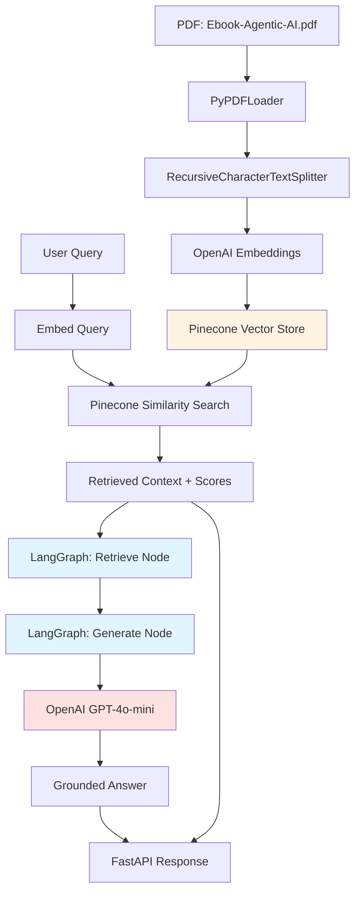

# Agentic AI RAG Chatbot

A production-ready **Retrieval-Augmented Generation (RAG)** chatbot that answers questions about Agentic AI using a provided eBook as its knowledge base. Built with **LangGraph** for workflow orchestration, **OpenAI** for embeddings and generation, **Pinecone** for vector storage, and **FastAPI** for the API layer.

## Overview

This project implements a complete RAG pipeline that:
- **Grounds answers exclusively in the provided Agentic AI eBook** — no hallucination from model training data
- **Refuses to answer out-of-domain queries** — explicitly returns "insufficient information" when the question cannot be answered from the eBook
- **Provides transparent retrieval confidence** — based on Pinecone cosine similarity scores
- **Returns source attribution** — every answer includes page numbers and context chunks
- **Uses LangGraph for orchestration** — clean state machine architecture (retrieve → generate)

## Key Features

- ✅ **Document-grounded responses only** — strict prompt engineering prevents hallucination
- ✅ **Out-of-domain refusal** — validates grounding behavior with benchmark tests
- ✅ **Transparent confidence scoring** — based on vector similarity, not arbitrary thresholds
- ✅ **Full source attribution** — page numbers, chunk text, and relevance scores
- ✅ **Automated ingestion pipeline** — PDF → chunks → embeddings → Pinecone
- ✅ **RESTful API** — FastAPI with OpenAPI documentation
- ✅ **Comprehensive test suite** — 6 benchmark queries including grounding validation

---

## Architecture

### High-Level Pipeline



### LangGraph Workflow

The RAG pipeline uses a two-node LangGraph `StateGraph`:

```
START → retrieve → generate → END
```

| Node | Responsibility |
|---|---|
| **retrieve** | Embeds the user query, queries Pinecone for top-K similar chunks (TOP_K=4), extracts similarity scores, computes confidence as mean similarity |
| **generate** | Constructs a grounded prompt with retrieved context, calls the LLM with strict system instructions, enforces refusal on low-confidence or insufficient context |

**State Schema:**
```python
class RAGState(TypedDict):
    question: str                    # User query
    context: list[dict]              # Retrieved chunks with metadata
    retrieval_scores: list[float]    # Pinecone similarity scores
    answer: str                      # Generated response
    confidence_score: float          # Mean retrieval similarity
```

### Key Design Decisions

- **Retrieval confidence scoring:** Uses the **mean cosine similarity** of retrieved chunks from Pinecone (not an arbitrary constant or model certainty). Scores below 0.60 trigger a low-relevance advisory injected into the LLM prompt.
- **Strict grounding enforcement:** The system prompt explicitly constrains the LLM to answer **only** from retrieved context and to refuse when information is unavailable. Temperature is set to 0.0 for deterministic responses.
- **Out-of-domain refusal:** When confidence is below threshold or context is irrelevant, the system returns: *"I don't have enough information in the eBook to answer this question."*
- **Direct Pinecone SDK:** Uses the `pinecone` SDK directly for vector operations instead of `langchain-pinecone` to avoid dependency conflicts.

---

## Project Structure

```
rag-agentic-ai/
├── data/
│   └── Ebook-Agentic-AI.pdf       # Source eBook (60 pages)
├── src/
│   ├── __init__.py
│   ├── config.py                   # Environment variables & constants
│   ├── ingestion.py                # PDF → chunks → embeddings → Pinecone
│   └── graph.py                    # LangGraph RAG workflow
├── app.py                          # FastAPI application
├── tests_sample_queries.py         # 6 benchmark test queries
├── requirements.txt                # Python dependencies
├── .env.example                    # Environment variable template
├── .gitignore
└── README.md
```

---

## Setup

### Prerequisites

- Python 3.10+
- OpenAI API key ([platform.openai.com](https://platform.openai.com))
- Pinecone API key ([pinecone.io](https://www.pinecone.io))

### 1. Clone and Navigate

```bash
git clone https://github.com/eshwarrao123/RAG-based-AI-Chatbot
cd rag-agentic-ai
```

### 2. Create Virtual Environment

**Windows (PowerShell):**
```powershell
python -m venv .venv
.venv\Scripts\Activate.ps1
```

**Windows (Command Prompt):**
```cmd
python -m venv .venv
.venv\Scripts\activate.bat
```

**macOS/Linux:**
```bash
python -m venv .venv
source .venv/bin/activate
```

### 3. Install Dependencies

```bash
pip install -r requirements.txt
```

**Note:** This project uses Python 3.10+ and has been tested on Windows, macOS, and Linux.

### 4. Configure Environment Variables

**Create `.env` file** (copy from `.env.example`):

```bash
# Unix/macOS/Linux
cp .env.example .env

# Windows
copy .env.example .env
```

Edit `.env` and add your API keys:

```env
# Required
OPENAI_API_KEY=sk-your-openai-key-here
PINECONE_API_KEY=your-pinecone-key-here

# Optional (defaults shown)
PINECONE_INDEX_NAME=agentic-ai-rag
PINECONE_CLOUD=aws
PINECONE_REGION=us-east-1
```

**Where to get API keys:**
- OpenAI: [platform.openai.com/api-keys](https://platform.openai.com/api-keys)
- Pinecone: [app.pinecone.io](https://app.pinecone.io) → API Keys

---

## Ingestion

Ingest the eBook PDF into Pinecone. This extracts text, chunks it, generates embeddings, and upserts vectors.

### Via CLI

```bash
python -m src.ingestion
```

### Via API (after starting the server)

```bash
curl -X POST http://localhost:8000/ingest
```

### What Happens

1. Loads the 60-page PDF using `PyPDFLoader`
2. Splits into ~100-120 chunks (1000 chars, 200 overlap)
3. Generates embeddings using `text-embedding-3-small` (1536 dims)
4. Creates the Pinecone index (if it doesn't exist) — serverless, cosine metric
5. Upserts all vectors with metadata (source, page number, chunk index)

---

## Running the Application

### Start the FastAPI Server

```bash
uvicorn app:app --reload --port 8000
```

The API documentation is available at: [http://localhost:8000/docs](http://localhost:8000/docs)

### API Endpoints

#### `POST /chat` — Ask a Question

**Request:**
```json
{
    "query": "What is Agentic AI?"
}
```

**Response:**
```json
{
    "query": "What is Agentic AI?",
    "final_answer": "Agentic AI refers to AI systems that can autonomously plan, reason, and take actions...",
    "retrieved_context_chunks": [
        {
            "text": "Agentic AI represents a paradigm shift...",
            "source": "data/Ebook-Agentic-AI.pdf",
            "page": 5,
            "relevance_score": 0.87
        }
    ],
    "confidence_score": 0.845
}
```

#### `GET /health` — Health Check

```bash
curl http://localhost:8000/health
```

#### `POST /ingest` — Trigger Ingestion

```bash
curl -X POST http://localhost:8000/ingest
```

---

## Testing

### Benchmark Test Suite

The project includes a comprehensive test suite with **6 benchmark queries**:

| # | Query | Type | Purpose |
|---|---|---|---|
| 1 | "What is the core definition of Agentic AI as outlined in the eBook?" | In-domain | Core definition |
| 2 | "What are the main architectural components required to build agentic systems?" | In-domain | Architectural components |
| 3 | "What real-world industry use cases for Agentic AI are discussed in the eBook?" | In-domain | Industry use cases |
| 4 | "How does Agentic AI differ from traditional generative AI chatbots according to the text?" | In-domain | Differentiation from traditional AI |
| 5 | "What key challenges or limitations of Agentic AI are mentioned in the document?" | In-domain | Challenges and limitations |
| 6 | **"What is the capital of France?"** | **Out-of-domain** | **Grounding/refusal validation** |

### Run Benchmark Tests

**Prerequisites:** Ensure the Pinecone index has been populated via ingestion (see [Ingestion](#ingestion) section).

```bash
python tests_sample_queries.py
```

**Expected output:**
- Queries 1-5: Should return grounded answers with confidence ≥ 0.60, with page citations
- Query 6: Should return refusal message ("I don't have enough information in the eBook to answer this question")

### Validation Criteria

Each test validates:
- ✅ Answer is returned and non-empty
- ✅ Context chunks are returned with complete metadata (text, source, page, relevance_score)
- ✅ Confidence score is computed and returned
- ✅ Retrieved pages are non-zero and valid
- ✅ **Out-of-domain grounding:** The system must NOT answer the France capital question from model knowledge; it must refuse with the standard insufficient-information response

### Grounding Behavior Validation

The benchmark specifically tests that the system:
1. **Does not hallucinate** — Query 6 tests whether the model can be tricked into answering from training data
2. **Explicitly refuses** — The answer must contain refusal language like "don't have enough information" or "not found in the eBook"
3. **Does not fabricate** — The answer must NOT contain "Paris" or other factual knowledge about France

This is a critical safety test for production RAG systems.

---

## Confidence Scoring

### What the Confidence Score Represents

The confidence score is the **retrieval relevance score** based on **mean cosine similarity** of the top-K retrieved chunks from Pinecone. 

**Important:** This score represents:
- ✅ How semantically similar the retrieved context is to the user's query
- ✅ The quality of the retrieval step (vector search performance)

**It does NOT represent:**
- ❌ The probability that the answer is factually correct
- ❌ The LLM's certainty about its response
- ❌ A guarantee of answer quality

### Score Interpretation

| Range | Interpretation |
|---|---|
| **≥ 0.80** | **High retrieval relevance** — Retrieved context is semantically very similar to the query |
| **0.60 – 0.79** | **Medium retrieval relevance** — Retrieved context is partially relevant |
| **< 0.60** | **Low retrieval relevance** — Retrieved context may not support an answer; refusal likely |

### Low-Confidence Handling

When confidence falls below `0.60` (configurable via `CONFIDENCE_THRESHOLD`), the system:
1. Adds an explicit low-relevance advisory to the LLM prompt
2. Reinforces the instruction to refuse if context is insufficient
3. Logs a warning for monitoring

This helps prevent the LLM from attempting to answer with weak or irrelevant context.

---

## Configuration

All settings are centralized in `src/config.py`:

| Parameter | Default | Description |
|---|---|---|
| `EMBEDDING_MODEL` | `text-embedding-3-small` | OpenAI embedding model |
| `LLM_MODEL` | `gpt-4o-mini` | OpenAI chat model (swap to `gpt-4o` for higher quality) |
| `LLM_TEMPERATURE` | `0.0` | Deterministic generation for grounded answers |
| `CHUNK_SIZE` | `1000` | Characters per text chunk |
| `CHUNK_OVERLAP` | `200` | Overlap between consecutive chunks |
| `TOP_K` | `4` | Number of chunks to retrieve |
| `CONFIDENCE_THRESHOLD` | `0.60` | Below this, low-relevance advisory is added |

---

## Tech Stack

| Component | Technology |
|---|---|
| Workflow Orchestration | LangGraph (`StateGraph`) |
| Embeddings | OpenAI `text-embedding-3-small` |
| LLM | OpenAI `gpt-4o-mini` |
| Vector Store | Pinecone (serverless, cosine) |
| PDF Processing | pypdf via LangChain `PyPDFLoader` |
| Text Splitting | LangChain `RecursiveCharacterTextSplitter` |
| API Framework | FastAPI |
| Server | Uvicorn |

---

## Error Handling

The application implements comprehensive error handling:

### API Level
- **Missing credentials:** Returns 500 with clear error message during startup
- **Malformed requests:** Returns 422 with validation errors (Pydantic)
- **Query processing errors:** Returns 500 with sanitized error details
- **Pinecone connectivity issues:** Health check reports "degraded" status

### Ingestion Level
- **Missing PDF:** Raises `FileNotFoundError` with clear path information
- **Pinecone index creation:** Automatically creates index if it doesn't exist
- **Batch upload failures:** Logged with batch range for debugging

### Graph Level
- **Empty retrieval results:** Handled gracefully; generates answer with low confidence
- **LLM API failures:** Propagated with full error context for debugging

All errors are logged with timestamps and context for production monitoring.

---

## Security Considerations

- **API keys:** Never commit `.env` to version control (`.gitignore` configured)
- **Input validation:** FastAPI/Pydantic validate all request inputs (max length: 1000 chars)
- **Rate limiting:** Not implemented (add `slowapi` for production)
- **CORS:** Not configured (add CORS middleware for browser clients)
- **Authentication:** Not implemented (add API key middleware for production)

**Production checklist:**
- [ ] Add rate limiting
- [ ] Configure CORS if serving browser clients
- [ ] Implement API key authentication
- [ ] Set up monitoring/logging aggregation
- [ ] Add request/response logging for audit trails
- [ ] Configure HTTPS/TLS

---

## Design Decisions & Tradeoffs

### Why LangGraph?
- **Explicit state management:** RAG workflows are inherently stateful (context flows from retrieve → generate)
- **Debuggability:** Each node can be tested independently; state transitions are traceable
- **Extensibility:** Easy to add nodes (e.g., re-ranking, query expansion, multi-hop retrieval)

### Why Direct Pinecone SDK?
- **Dependency conflicts:** `langchain-pinecone` had conflicts with Python 3.10+ environments
- **Control:** Direct SDK provides more explicit control over query parameters and metadata
- **Simplicity:** Fewer abstraction layers for a straightforward use case

### Why Cosine Similarity?
- **Standard for text embeddings:** OpenAI embeddings are normalized; cosine similarity is appropriate
- **Interpretable scores:** Range [0, 1] maps naturally to confidence percentages

### Chunking Strategy
- **1000 characters with 200 overlap:** Balances context completeness vs. retrieval granularity
- **RecursiveCharacterTextSplitter:** Respects document structure (paragraphs, sentences)
- **Tradeoff:** Larger chunks = more context but less precise retrieval; smaller chunks = more precise but may lack context

### Temperature = 0.0
- **Deterministic responses:** Same query should return same answer for consistency
- **Grounding compliance:** Lower temperature reduces creative elaboration beyond context

---

## Limitations

1. **Single document source:** Only answers from one eBook; no multi-source retrieval
2. **No query expansion:** Does not automatically rephrase or expand queries for better retrieval
3. **No re-ranking:** Uses raw Pinecone similarity scores without a learned re-ranker
4. **No conversational memory:** Each query is independent; no chat history context
5. **English only:** No multi-language support (embeddings and LLM are English-centric)
6. **No citation verification:** Page numbers are metadata-driven; not verified post-generation
7. **Fixed chunk size:** Does not adapt chunking strategy to document structure

---

## Future Improvements

### Short Term
- [ ] Add conversational memory (chat history in state)
- [ ] Implement query expansion for better recall
- [ ] Add hybrid search (keyword + vector)
- [ ] Support multiple document sources
- [ ] Add streaming responses for better UX

### Medium Term
- [ ] Implement learned re-ranker (e.g., Cohere Rerank, Cross-Encoder)
- [ ] Add multi-hop reasoning for complex queries
- [ ] Build evaluation harness with labeled Q&A pairs
- [ ] Add prompt caching for cost optimization
- [ ] Implement citation verification (post-generation fact-checking)

### Long Term
- [ ] Multi-language support with multilingual embeddings
- [ ] Agentic capabilities (tool use, web search fallback)
- [ ] Fine-tune embeddings on domain data
- [ ] Add user feedback loop for iterative improvement
- [ ] Implement RAG observability dashboard

---

## Troubleshooting

### Common Issues

**"Missing required environment variables"**
- Ensure `.env` exists and contains `OPENAI_API_KEY` and `PINECONE_API_KEY`
- Verify the virtual environment is activated

**"Pinecone index not found"**
- Run ingestion first: `python -m src.ingestion`
- Check `PINECONE_INDEX_NAME` matches between config and Pinecone dashboard

**"Empty context returned"**
- Verify ingestion completed successfully (check vector count in Pinecone)
- Try a more specific query
- Check embedding model matches between ingestion and retrieval

**"Rate limit exceeded"**
- OpenAI free tier has rate limits; upgrade or wait
- Pinecone free tier limits vectors/requests

**Tests fail with "No module named 'src'"**
- Ensure you're running from the project root: `rag-agentic-ai/`
- Virtual environment must be activated

---

## Development

### Project Structure Details

```
src/
├── config.py          # Centralized configuration (environment variables, constants)
├── ingestion.py       # PDF → chunks → embeddings → Pinecone pipeline
└── graph.py           # LangGraph workflow (retrieve, generate nodes)

app.py                 # FastAPI application (endpoints, request/response models)
tests_sample_queries.py # Benchmark test suite (6 queries with validation)
```

### Adding New Features

**To add a new retrieval strategy:**
1. Modify `src/graph.py:retrieve()` to implement new search logic
2. Update `RAGState` if new state fields are needed
3. Test with `python -m src.graph` (includes a standalone test query)

**To add a new endpoint:**
1. Define request/response models in `app.py` (Pydantic)
2. Implement endpoint function with `@app.post()` or `@app.get()`
3. Test via `/docs` or curl

**To change chunking strategy:**
1. Modify `CHUNK_SIZE` and `CHUNK_OVERLAP` in `src/config.py`
2. Re-run ingestion: `python -m src.ingestion`

---

## License

This project was created as a take-home assignment submission.

---

## Contact & Support

For questions, issues, or feedback about this implementation, please refer to the project repository or contact the developer.

**Built with:** LangGraph • OpenAI • Pinecone • FastAPI
